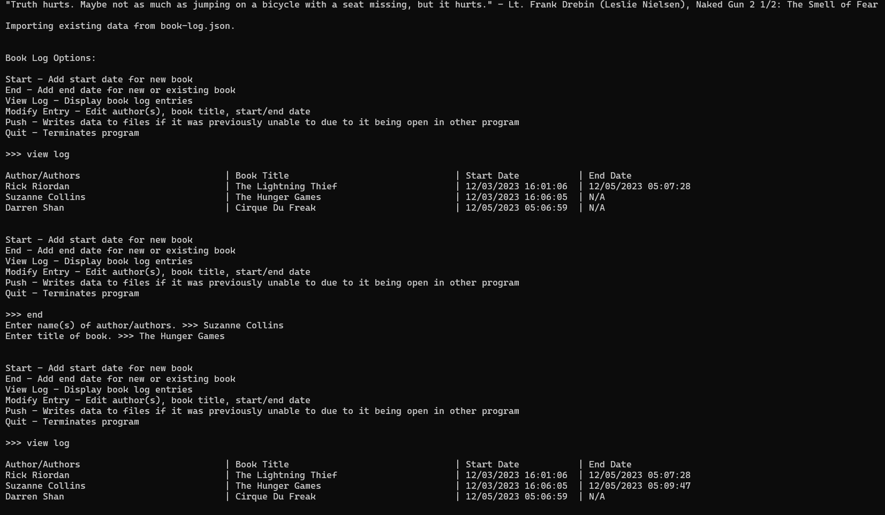
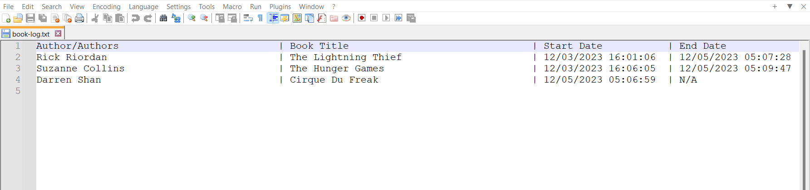
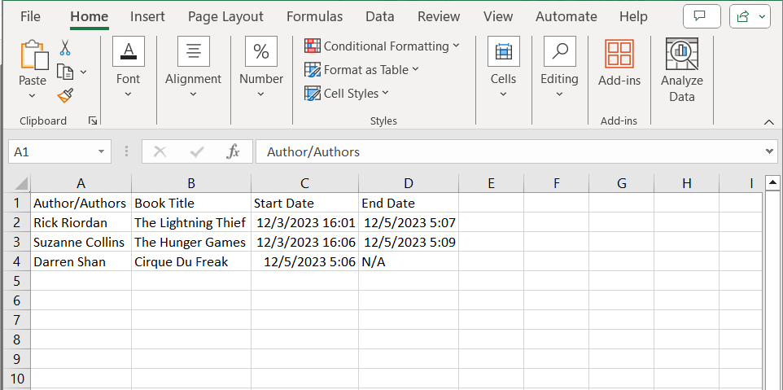

# **book-logger**

A simple Python program for tracking when a book has been started and finished.

	

## Features: ##
* Welcomes the user with a randomized quote
* Easily portable, just copy over the entire project to a flash drive and run on a machine with  
Python >= 3.11 (or with a portable version of Python)
* Saves the book log data into a json file so it can read and write to it each time the program is used.
* Formats book log entries and saves them to a text and csv file so you can view the book log at any time and easily see
the amount of reading you've done! These files are written to the Documents directory of your machine once an entry has 
been made. You can make copies of these and upload them to the cloud, or share with your friends!
* Allows for editing of entries, to fix a typo or change the date. 
* Includes a built-in option for viewing what the text file of your book log looks like.

	
	

### Start ###
With the Start command, you can create a new entry within your log that creates a timestamp of the moment you enter an 
author (or authors) and the book's title for the entry. By default, the End Date will be set to N/A until modified or
the End command is used.
### End ###
With the End command, you can finish an existing entry, or you can add an entry for a book that you had already started 
reading, but haven't logged yet. This command also creates a timestamp of the moment you entered the fields.
### Modify Entry ###
If you would like to modify the dates to something else or fix a typo within the Book Title or Authors' names, you can 
use the Modify Entry command to change any of the fields within an entry.
### View Log ###
With the View Log command, you can view the contents of your log that reflects how it will look within the text file the
program produces.
### Push ###
Sometimes if the csv file is opened (e.g. with Excel), it prevents the book logger from being able to write to the csv 
file. Because of this, it's up to the user to avoid setting/modifying entries with the book logger until the csv is 
closed. As a fail-safe, you can use the Push command to push updated data to the text and csv files. This command can be
useful if you forget to close out of Excel and leave the file opened in the background and attempt to update your log 
with book logger. Book logger will warn you if the csv is opened within another program.
### Quit ###
The Quit command exits the program. You can use this when working with a bash or shell to return to the command line 
interpreter. Force closing the program without using Quit shouldn't affect whether data is written to files or not.
## Requirements: ##
[Python 3.11](https://www.python.org/downloads/release/python-3110/) or later